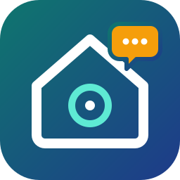

<p align="center"></p>

# Claude → Alexa

Connettore (server MCP) che permette a Claude di comandare la domotica di Alexa, anche dall'app sul telefono. Costo: zero.

```
App Claude  →  server Anthropic  →  Tailscale Funnel (HTTPS)  →  server.js sul computer  →  Alexa  →  Echo
```

Usa l'API non ufficiale di Alexa (libreria `alexa-remote2`): se Amazon cambia qualcosa può smettere di funzionare.

- Parti da zero? Vai a [Configurazione da zero](#configurazione-da-zero).
- È già configurato? Vai a [Se è già configurato](#se-è-già-configurato).

## Strumenti disponibili in Claude

| Strumento | Cosa fa |
|---|---|
| `comando_alexa` | Invia un comando testuale all'Echo, come se lo dicessi a voce |
| `lista_dispositivi` | Elenca i dispositivi domotici |
| `lista_echo` | Elenca gli Echo e se sono online |

## File della cartella

| File | A cosa serve | Segreto? |
|---|---|---|
| `server.js` | Il server | no |
| `avvia.command` / `ferma.command` | Avvio e stop con doppio click (Mac) | no |
| `avvia.bat` / `ferma.bat` | Avvio e stop con doppio click (Windows) | no |
| `config.example.json` | Modello per il file di configurazione `config.json` | no |

### File segreti (non presenti nel repository)

Sono esclusi da git tramite `.gitignore` e non vanno mai condivisi: danno accesso alla casa e all'account Amazon.

| File | Cosa contiene | Come si crea |
|---|---|---|
| `token.txt` | Token segreto che protegge l'URL | Da solo, al primo avvio del server |
| `cookie.json` | Sessione Amazon | Da solo, dopo il login Amazon (passo 3) |
| `config.json` | Nome dell'Echo predefinito e paese | A mano, facoltativo (passo 4) |
| `url-connettore.txt` | Promemoria dell'URL completo del connettore | A mano, facoltativo (passo 6) |
| `node_modules/` | Dipendenze | Con `npm install` (passo 2) |
| `server.log` | Log del server su Windows | Da solo, con `avvia.bat` |

---

## Configurazione da zero

I passi per Windows non sono stati provati su una macchina reale.

### Cosa serve

- Un account Amazon con almeno un dispositivo Echo: i comandi passano da lì.
- Un piano Claude che permetta i connettori personalizzati (provato con Pro).
- Un computer Mac o Windows che resti acceso: il server gira lì.
- Un account Tailscale gratuito: https://tailscale.com

### 1. Scarica il progetto

Clona il repository (o scaricalo come ZIP da GitHub), sostituendo l'indirizzo:

```bash
git clone https://github.com/<utente>/<repository>.git
```

I file segreti non sono nel repository: non devi crearli tu, compaiono da soli nei passi successivi.

### 2. Installa Node.js e le dipendenze

Installa Node.js LTS da https://nodejs.org, poi apri un terminale nella cartella (su Windows: PowerShell):

```bash
npm install
```

### 3. Primo avvio e login Amazon

```bash
node server.js
```

1. Apri http://localhost:3001 nel browser del computer e fai il login con l'account Amazon di Alexa.
2. Nel terminale compare `Alexa collegata:` seguito dai nomi dei tuoi dispositivi Echo.

### 4. Scegli l'Echo predefinito e il paese (facoltativo)

Senza configurazione il server usa Amazon Italia e il primo Echo online. Per cambiare:

1. Copia `config.example.json` in un nuovo file `config.json`.
2. In `defaultEcho` metti il nome esatto di uno dei tuoi Echo, tra quelli comparsi al passo 3. Consigliato se hai più di un Echo.
3. Per un paese diverso dall'Italia cambia gli altri valori, ad esempio `amazon.de`, `alexa.amazon.de`, `de-DE`, `de_DE`. Se cambi paese dopo aver fatto il login, cancella `cookie.json` e rifai il passo 3.
4. Ferma il server con Ctrl+C e riavvialo con `node server.js`.

Lascia il terminale aperto.

### 5. Rendi il server raggiungibile con Tailscale Funnel

1. Installa Tailscale da https://tailscale.com/download e accedi.
2. In un secondo terminale:

   Mac:
   ```bash
   /Applications/Tailscale.app/Contents/MacOS/Tailscale funnel --bg 3000
   ```

   Windows:
   ```powershell
   tailscale funnel --bg 3000
   ```

3. La prima volta il comando mostra un link: aprilo e abilita Funnel. Il comando si completa da solo.
4. Alla fine stampa l'indirizzo pubblico, ad esempio `https://nome-pc.tailXXXX.ts.net`.

Funnel resta attivo anche dopo i riavvii, insieme a Tailscale.

### 6. Componi l'URL del connettore

```
https://nome-pc.tailXXXX.ts.net/<contenuto di token.txt>/mcp
```

Chi conosce questo URL può comandare la tua casa: non condividerlo. Senza il token il server risponde 404.

Se vuoi tenerlo come promemoria, salvalo in un file chiamato `url-connettore.txt` nella cartella: è già escluso da git.

### 7. Aggiungi il connettore in Claude

1. Vai su https://claude.ai/settings/connectors → **Aggiungi connettore personalizzato**.
2. Nome: `Alexa`. URL: quello del passo 6.
3. Autenticazione: **Nessun accesso**, nessun header. L'avviso giallo è normale: la protezione è il token nell'URL.
4. Salva.

### 8. Prova dal telefono

1. Apri l'app Claude e inizia una nuova chat. Se il connettore non compare, chiudi e riapri l'app.
2. Dal menu degli strumenti controlla che **Alexa** sia attivo.
3. Scrivi, per esempio: "Che dispositivi ho su Alexa?" e poi "Accendi la luce del salotto".
4. Alla richiesta di permesso scegli **Consenti sempre**.

### 9. Avvio automatico all'accensione

Perché tutto riparta da solo dopo un riavvio servono quattro cose: il server, Tailscale, l'accesso automatico all'utente e il computer che non va in stop.

Ferma prima il server avviato a mano (Ctrl+C).

**Mac**

1. **Server**: doppio click su `avvia.command`. Se macOS lo blocca: tasto destro → Apri. Lo script registra da solo il servizio di avvio automatico (`~/Library/LaunchAgents/com.claude-alexa.server.plist`) con i percorsi giusti. Lo script attiva anche Tailscale Funnel, se non lo è già. Se sposti la cartella, rilancia `avvia.command`. La cartella non deve stare in Scrivania, Documenti o Download: macOS impedisce ai servizi di leggerle e il server non partirebbe.
2. **Tailscale**: icona di Tailscale nella barra dei menu → Impostazioni → attiva l'avvio al login. Funnel (passo 5) riparte insieme a Tailscale, non va rilanciato.
3. **Accesso automatico**: il server parte al login, non all'accensione. Se il Mac si riavvia da solo (aggiornamento, blackout) resta fermo alla schermata di accesso. Per evitarlo: Impostazioni di Sistema → Utenti e gruppi → **Accedi automaticamente come**. L'opzione non è disponibile con FileVault attivo.
4. **Niente stop**: Impostazioni di Sistema → Energia (sui portatili: Batteria → Opzioni) → attiva **Impedisci lo stop automatico quando il monitor è spento** e, se presente, **Riavvia automaticamente dopo un'interruzione di corrente**. In alternativa, da terminale:

   ```bash
   sudo pmset -a sleep 0 autorestart 1
   ```

   Un portatile con il coperchio chiuso va comunque in stop, a meno che sia alimentato e collegato a un monitor esterno.

**Windows**

1. **Server**: in PowerShell, correggendo il percorso (senza spazi):

   ```powershell
   schtasks /create /tn "ClaudeAlexa" /sc onlogon /tr "C:\percorso\claude-alexa\avvia.bat auto"
   ```

   Poi doppio click su `avvia.bat`, che attiva anche Tailscale Funnel se non lo è già. Per togliere l'avvio automatico: `schtasks /delete /tn "ClaudeAlexa" /f`.
2. **Tailscale**: parte già da solo come servizio di Windows. Per tenerlo connesso anche prima del login: icona di Tailscale nell'area di notifica → Preferences → **Run unattended**. Funnel (passo 5) riparte insieme a Tailscale.
3. **Accesso automatico**: il server parte al login, non all'accensione. Premi Win+R, scrivi `netplwiz`, togli la spunta da **Per utilizzare questo computer è necessario che l'utente immetta il nome e la password** e conferma con la password. Se la spunta non compare, disattiva prima l'accesso con Windows Hello in Impostazioni → Account → Opzioni di accesso.
4. **Niente sospensione**: Impostazioni → Sistema → Alimentazione → Schermo e sospensione → sospensione **Mai** quando è collegato alla corrente. In alternativa, da PowerShell:

   ```powershell
   powercfg /change standby-timeout-ac 0
   ```

Con l'accesso automatico chiunque accenda il computer entra senza password: attivalo solo se il computer sta in un posto sicuro.

**Verifica**

Riavvia il computer e non toccarlo. Dopo un paio di minuti chiedi a Claude dal telefono "Che dispositivi ho su Alexa?": se risponde, parte tutto da solo.

---

## Se è già configurato

### Uso quotidiano

- Il server parte da solo al login e, su Mac, si riavvia se va in crash. Per farlo ripartire anche dopo un riavvio del computer senza toccare nulla, vedi il [passo 9](#9-avvio-automatico-allaccensione).
- Funziona solo con il computer acceso e non in stop.
- Mac: `avvia.command` e `ferma.command`. Lo stop vale fino al prossimo avvio manuale o al prossimo login. Log: `~/Library/Logs/claude-alexa.log`
- Windows: `avvia.bat` e `ferma.bat`. Log: `server.log` nella cartella.

### Problemi comuni

| Problema | Soluzione |
|---|---|
| Claude dice che il connettore non risponde | Computer spento o in stop, oppure server fermo: avvialo con `avvia` |
| Nel log: "Alexa non collegata" | Sessione Amazon scaduta: apri http://localhost:3001 e rifai il login |
| Errore "Echo ... non trovato" | Il nome in `config.json` non corrisponde più: correggilo (passo 4) |
| Il comando parte ma non succede nulla | Controlla che l'Echo sia online e che il nome del dispositivo sia quello dell'app Alexa |
| Ha smesso di funzionare dopo mesi | Prova `npm update` e riavvia il server |

### Cambiare il token

Da fare se temi che l'URL sia stato visto da altri.

1. Ferma il server e cancella `token.txt`.
2. Riavvia il server: ne crea uno nuovo.
3. Componi il nuovo URL (passo 6) e sostituiscilo nel connettore su claude.ai.

### Cambiare computer (anche da Mac a Windows)

Segui la [configurazione da zero](#configurazione-da-zero) sul nuovo computer, con queste differenze:

- **Passo 1**: puoi copiare a mano `token.txt` dal vecchio computer per mantenere lo stesso token.
- **Passo 4**: copia a mano anche `config.json` e saltalo.
- **Passo 5**: Funnel è già abilitato sul tuo account, non compare il link di approvazione.
- **Passo 7**: l'indirizzo cambia con il nome del computer, quindi apri il connettore esistente e sostituisci l'URL invece di crearne uno nuovo.

Poi spegni tutto sul vecchio computer.

Mac:

```bash
/Applications/Tailscale.app/Contents/MacOS/Tailscale funnel --https=443 off
```

Infine doppio click su `ferma.command` ed elimina `~/Library/LaunchAgents/com.claude-alexa.server.plist`.

Windows: `tailscale funnel --https=443 off`, poi `ferma.bat` e `schtasks /delete /tn "ClaudeAlexa" /f`.

---

## Avvertenze

- Progetto non ufficiale, non affiliato né approvato da Amazon o da Anthropic. Alexa, Echo e Claude sono marchi dei rispettivi proprietari.
- Usa un'API non documentata di Alexa: può smettere di funzionare senza preavviso e il suo uso è a tuo rischio.
- Il server espone su internet un indirizzo che comanda i dispositivi di casa: tieni segreto l'URL con il token e non collegare dispositivi critici (serrature, allarmi) senza averci pensato.
